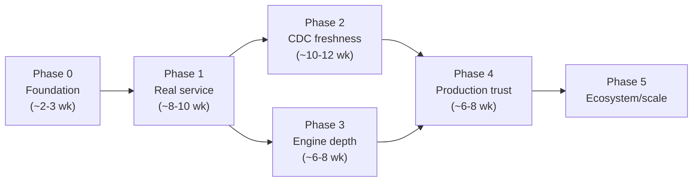

# 🍙 Igloo Roadmap: From Proof-of-Concept to 10x Value

**Status:** Draft for review · **Last updated:** 2026-07-06

---

## 1. Where the codebase stands today

An honest assessment of the current state (~865 lines of Rust across 7 modules, as of the build-fix/cleanup merged in PR #12), because the roadmap only makes sense against it:

| Area | Current reality | Reference |
|---|---|---|
| Process model | A binary that executes **one hardcoded query** and exits. There is no server, no client interface, no way for a second query to arrive. | `src/main.rs:36` |
| Cache | `HashMap<String, String>` mapping the exact query text to a **pretty-printed string** of the result. No TTL, no eviction, no memory bound, not shared across threads, lost on exit. A cache hit requires a byte-identical query string. | `src/cache_layer.rs:8` |
| CDC | File-based simulation: reads JSON event files from a local directory and, if any exist, conservatively **clears the entire cache**. No per-table granularity; remote (S3/Iceberg) CDC is an unimplemented warning. | `src/cdc_sync.rs:27-55` |
| Iceberg | Not actually Iceberg — a DataFusion `ListingTable` over loose Parquet files with a hardcoded two-column schema. No catalog, no snapshots, no schema evolution. | `src/datafusion_engine.rs:30-48` |
| Postgres federation | A single hardcoded table (`my_pg_table`) with a hardcoded schema. `scan()` pushes **LIMIT** down and quotes identifiers, but there is **no filter or aggregate pushdown**; every matching row is buffered in memory and rebuilt into Arrow arrays row-by-row. | `src/postgres_table.rs:75-90` |
| ADBC | A demonstration function that runs `SELECT 1` and prints the result. Not wired into query execution. | `src/adbc_postgres.rs:15` |
| Configuration | Env vars with silent fallbacks to localhost defaults (violates fail-fast). | `src/main.rs:26-31` |
| Tests | 11 hermetic unit tests (cache semantics, CDC sync, identifier quoting, a Parquet query through DataFusion). **No integration tests** against a live Postgres — the federation path is untested. | `src/cache_layer.rs:43`, `src/cdc_sync.rs:80` |
| Dependencies | Recently modernized: DataFusion 44 / Arrow 53 unified across the tree, MSRV 1.80.1, unused deps removed. Still a single crate, no license/advisory auditing, and DataFusion 44 will keep drifting behind without a policy for tracking releases. | `Cargo.toml` |

**The one-sentence gap:** Igloo's promise is *"sub-millisecond SQL over live operational databases, kept fresh automatically by CDC"* — but today nothing can connect to it, the cache can't hold data (only display strings), and the CDC loop doesn't exist.

## 2. What "10x more valuable" means

The 10x does not come from polishing any single module. It comes from crossing three thresholds, in order:

1. **Usable at all** — a long-running server that real clients (BI tools, `psql`, Python) can send arbitrary SQL to. Without this the value is zero regardless of internals; with it, everything else compounds.
2. **The differentiator works** — CDC-driven cache freshness is the reason Igloo exists instead of "Postgres + a Redis string cache". Real logical-replication ingestion plus dependency-aware invalidation turns the cache from "stale answers fast" into "correct answers fast", which is the entire pitch.
3. **Trustworthy in production** — observability, security, bounded memory, and tests. This converts "cool demo" into "thing a team is allowed to deploy".

The roadmap below is organized into five phases. Each feature has explicit acceptance criteria; a feature is not "done" until every criterion passes in CI or is demonstrated in a documented runbook.

---

## Phase 0 — Foundation (prerequisite for everything)

> Goal: make change safe. No new user-facing capability, but every later phase depends on this.

### F0.1 Test harness and CI quality gates

Build on the unit-test baseline from PR #12 (cache, CDC sync, identifier quoting, Parquet-path query): add integration tests against real services via `testcontainers-rs` — the Postgres federation path currently has zero test coverage — and CI that fails on regressions.

**Acceptance criteria**
- [ ] `cargo test` runs unit tests covering: cache get/set/eviction semantics (partially in place), error-type conversions, and SQL-to-table-dependency extraction (once F2.2 lands, tests extend to it).
- [x] An integration test suite executes a federated query (Parquet ⋈ Postgres) against a live PostgreSQL and asserts on the Arrow results — not on log output. *(Implemented as `tests/postgres_federation.rs`, gated on `IGLOO_TEST_POSTGRES_URI` so plain `cargo test` stays hermetic; CI provides a Postgres service container. Testcontainers can replace the gate later if per-test isolation is needed.)*
- [x] CI runs fmt + clippy (`-D warnings`) + unit tests **and** the integration suite on every PR (integration runs as a separate job with a Postgres service).
- [x] A regression test exists for every bug fixed from this point forward (enforced by the Testing Requirements section in `CONTRIBUTING.md`).
- [ ] Code coverage is measured (e.g. `cargo-llvm-cov`) and reported on PRs; no hard threshold initially, but the trend is visible. *(A non-blocking `coverage` CI job is in place; tick once it proves itself and the trend is actually being watched.)*

### F0.2 Workspace layout and dependency hygiene

PR #12 already did the rescue work (DataFusion 39→44, one Arrow major across the tree, MSRV 1.80.1, dead deps removed). What remains is structural: split the crate into a workspace (`igloo-core`, `igloo-server`, `igloo-cache`, `igloo-connectors`) so components are testable and reusable in isolation, and put dependency currency on a policy instead of heroics.

**Acceptance criteria**
- [ ] The build is a Cargo workspace; `igloo-cache` and `igloo-connectors` compile and pass their tests without the server crate.
- [ ] MSRV is enforced in CI (a dedicated MSRV job), and a documented policy states how closely DataFusion/Arrow track upstream releases (e.g. within one major version).
- [x] `cargo deny` (or equivalent) runs in CI for license/advisory checks; the Dependabot findings currently open against main are resolved or explicitly waived. *(All five vulnerabilities fixed via `cargo update`; the unmaintained `paste` advisory is waived in `deny.toml` with rationale until the next arrow/datafusion major.)*
- [ ] Behavior parity across any future major upgrade: the federated join demo (Parquet ⋈ Postgres) produces identical results, proven by an integration test that exists *before* the upgrade lands (depends on F0.1).

### F0.3 Fail-fast configuration system

Replace scattered `env::var(...).unwrap_or_else(localhost)` with a typed config (config file + env overrides, e.g. `figment` or `config`): sources, cache limits, listen addresses, credentials via env/secret refs only.

**Acceptance criteria**
- [x] Starting Igloo without required configuration (e.g. no data sources defined) exits non-zero with a message naming the missing key — no silent localhost defaults.
- [x] A commented `igloo.example.toml` documents every option; the README configuration reference covers it.
- [x] Secrets (DB passwords) are redacted by the `Secret` config type in `Debug`/`Display`/logs, verified by a unit test; docs steer credentials to env vars rather than checked-in files.
- [x] Invalid values (bad connection string, empty paths) fail at startup with a validation error, covered by unit tests. *(Extends to numeric limits like cache sizes when those options appear in F1.4.)*

---

## Phase 1 — Become a real database service (the first 10x threshold)

> Goal: anyone can point a SQL client at Igloo and query their data. This phase converts Igloo from a demo binary into a product.

### F1.1 Long-running query server with PostgreSQL wire protocol

Implement a server daemon speaking the Postgres wire protocol (via `pgwire`), so `psql`, BI tools (Metabase, Grafana, Superset), and every Postgres driver in every language work with zero client-side changes. This is the highest-leverage single feature in the roadmap: it multiplies the audience from "people willing to edit `main.rs`" to "anyone with a SQL client".

> **Status:** walking skeleton landed (`igloo serve`, `src/server.rs`): simple-query protocol over plaintext TCP, arbitrary SQL → DataFusion, per-query errors keep the connection alive, integration-tested with tokio-postgres as the client. Still open before the criteria below pass: extended query protocol/prepared statements, auth, the concurrent-load test, and the BI-tool walkthrough.

**Acceptance criteria**
- [ ] `igloo serve` starts a daemon that listens on a configured address and serves concurrent connections until stopped; clean shutdown on SIGTERM drains in-flight queries.
- [ ] `psql -h <igloo> -c "SELECT ..."` executes arbitrary SQL against registered sources and returns correct results, including simple/extended query protocol, prepared statements with parameters, and error responses that don't kill the connection.
- [ ] At least one mainstream BI tool (Grafana or Metabase, using its stock Postgres connector) can connect, list tables, and render a query — documented with a walkthrough.
- [ ] Concurrent-load integration test: ≥ 50 simultaneous connections issuing mixed queries complete without errors, deadlocks, or unbounded memory growth.
- [ ] A malformed query returns a protocol-correct error message; the server never panics on client input (fuzz/property test over the parse path).

### F1.2 Arrow Flight SQL endpoint

For data-engineering clients (Python/pandas/Polars, JDBC Flight SQL driver), serve Arrow Flight SQL alongside pgwire. Results transfer as Arrow batches with zero serialization loss — the natural interface for an Arrow-native engine and dramatically faster for large results.

**Acceptance criteria**
- [ ] `pyarrow.flight`/ADBC Flight SQL client can connect, run a query, and receive results as Arrow record batches whose schema matches the pgwire answer for the same query.
- [ ] Large-result benchmark documented: fetching a ≥ 1M-row result via Flight SQL is at least 5x faster than the pgwire path for the same query.
- [ ] Both endpoints share one query-execution and cache path (verified: a query cached via pgwire hits the cache when re-issued over Flight SQL).

### F1.3 Dynamic catalog: source registration and schema introspection

Kill the hardcoded schemas. Sources are declared in config (and later via SQL `CREATE EXTERNAL TABLE` / catalog API); Igloo introspects `information_schema` to discover tables and column types, mapping Postgres types to Arrow types automatically.

**Acceptance criteria**
- [ ] Adding a Postgres source in `igloo.toml` (name + URI + optional schema/table allowlist) makes all its tables queryable by `<source>.<schema>.<table>` name with no Rust code changes.
- [ ] Type-mapping table covers at minimum: all int/float/numeric widths, text/varchar, bool, bytea, date, timestamp/timestamptz, uuid, json/jsonb (as Utf8 initially); unsupported types degrade to an explicit per-column error at registration, not a runtime panic.
- [ ] `SHOW TABLES` / `information_schema` queries against Igloo itself list the federated catalog (so BI tools can browse).
- [ ] Schema drift handling: if an upstream column is dropped, the next query referencing it returns a clear "schema changed, re-register" error rather than corrupt results; covered by an integration test that ALTERs the upstream table mid-session.

### F1.4 A real cache: Arrow-native, plan-keyed, bounded

Replace the string HashMap with a cache that stores **Arrow `RecordBatch`es** keyed by a **fingerprint of the normalized logical plan** (so `select * from t where id=42` and `SELECT *  FROM t WHERE id = 42` share an entry), with TTL, LRU eviction under a configurable memory budget, and thread-safe concurrent access (e.g. `moka`).

> **Status:** intermediate step landed: the cache now stores Arrow `RecordBatch`es, is thread-safe (`Arc<Cache>`), enforces a configurable max-entries LRU bound and TTL (injectable clock, tested without sleeps), keys on quote-aware whitespace-normalized SQL, and exposes hit/miss/eviction counters via `stats()`. Still open for the criteria below: plan-fingerprint keying, a byte-budget (entries-count only today), metrics export, and `EXPLAIN` cache provenance.

**Acceptance criteria**
- [ ] Cache stores Arrow data; a cache hit returns batches byte-identical (schema + data) to a fresh execution, verified by an integration test. *(Storage is Arrow-native now; the integration-test assertion is still to be written.)*
- [ ] Key is derived from the normalized/optimized logical plan: whitespace, case, and semantically-equivalent literal formatting differences hit the same entry (unit-tested with ≥ 10 equivalence pairs and ≥ 5 non-equivalence pairs).
- [ ] Memory budget is enforced: filling the cache past `cache.max_bytes` evicts LRU entries and the process RSS stays bounded under a sustained-insert stress test.
- [ ] Per-entry TTL and a global default TTL are configurable; an expired entry re-executes and repopulates.
- [ ] Cache hit/miss/eviction/size are exposed as metrics (see F4.1) and via `EXPLAIN`-style output that tells the user whether a result came from cache and how old it is.
- [ ] Concurrency: N threads hammering get/set on overlapping keys produce no torn reads or deadlocks (loom or stress test).

**Phase 1 exit demo:** `docker compose up`, connect Grafana, browse tables from two configured Postgres databases, run a dashboard; second page-load is served from cache in single-digit milliseconds with a visible cache-hit metric.

---

## Phase 2 — CDC-driven freshness (the differentiator)

> Goal: the cache is not just fast but *provably fresh*. This is what no "database + Redis" stack gives you and is Igloo's reason to exist.

### F2.1 Real CDC ingestion via Postgres logical replication

Replace the dummy JSON reader with a CDC listener consuming Postgres logical replication (`pgoutput` protocol) per configured source: create/manage replication slots and publications, decode insert/update/delete/truncate events with table identity and transaction LSN, and survive restarts by persisting confirmed LSNs.

**Acceptance criteria**
- [ ] With CDC enabled for a source, an `INSERT`/`UPDATE`/`DELETE`/`TRUNCATE` on any published table is observed by Igloo as a decoded event (table, op, LSN) within a configurable propagation window (default target ≤ 1 s on a local network), verified by integration tests for all four op types.
- [ ] Slot lifecycle is managed: Igloo creates the slot/publication on first run (or uses a preconfigured one), resumes from the last confirmed LSN after a restart with **no missed events** (kill-and-restart integration test with writes during downtime), and documents WAL-retention implications in ops docs.
- [ ] Replication connection failure triggers bounded exponential-backoff reconnect; during the outage the cache degrades safely per policy (F2.2), never serves silently-stale data past its configured tolerance.
- [ ] CDC lag (seconds and bytes behind the source LSN) is exported as a metric.

### F2.2 Dependency-aware cache invalidation

Today any CDC event clears the entire cache (`src/cdc_sync.rs:45-52`) — safe, but it destroys the hit-rate under any write load. Replace this with plan-time extraction of the upstream tables each cached entry depends on, plus a reverse index (table → cache keys), so a CDC event for a table invalidates exactly the dependent entries.

**Acceptance criteria**
- [ ] Table-dependency extraction from the logical plan handles joins, subqueries, CTEs, and views; unit-tested against a corpus of ≥ 30 queries including the current demo join.
- [ ] End-to-end freshness test: query result cached → row updated upstream → within the propagation window, re-issuing the query returns the new value (cache miss or refreshed entry), for both pgwire and Flight SQL paths.
- [ ] Precision: a write to table A does **not** invalidate cached entries depending only on table B (asserted via cache metrics in the integration test).
- [ ] A per-source staleness policy is configurable: `invalidate` (default), `serve-stale-while-revalidate` with a max-staleness bound, or `ttl-only` for sources without CDC; each mode covered by a test.
- [ ] Every query response can report its freshness: result age and the source LSN/watermark it reflects (surfaced via `EXPLAIN` or a session variable).

### F2.3 Incremental result maintenance (materialized-view refresh)

For hot queries, go beyond invalidate-and-recompute: register queries as materialized views whose cached results are **incrementally updated** from CDC deltas — starting with the tractable class (filter/projection over a single table, then simple aggregations with additive updates), falling back to full recompute for everything else.

**Acceptance criteria**
- [ ] `CREATE MATERIALIZED VIEW ... WITH (refresh = incremental)` (or config equivalent) registers a view; unsupported query shapes are rejected at creation with a message stating why and falling back to `refresh = full`.
- [ ] For a supported single-table filtered view, an upstream insert/update/delete is reflected in the view **without** re-scanning the base table (verified by observing zero upstream scan queries during refresh, e.g. via `pg_stat_statements` in the integration test).
- [ ] For additive aggregates (COUNT/SUM/MIN-on-insert etc.), incremental refresh produces results identical to a from-scratch recompute — property-tested with randomized event streams.
- [ ] A correctness kill-switch exists: any inconsistency detected (checksum/row-count divergence on periodic audit) demotes the view to full recompute and raises an alert metric.

### F2.4 First-class Iceberg tables

Replace the Parquet `ListingTable` masquerading as "iceberg" with real Iceberg support via `iceberg-rust`: connect to a REST (and file-based) catalog, read tables with correct snapshot isolation, schema evolution, and partition pruning; use Iceberg's incremental snapshot diffs as a second CDC source (for lakehouse tables) feeding the same invalidation machinery as F2.2.

**Acceptance criteria**
- [ ] Igloo reads an Iceberg table registered in a REST catalog (integration test against a catalog container, e.g. the reference REST image + MinIO) with results matching Spark/pyiceberg reads of the same snapshot.
- [ ] Schema evolution (added/renamed column across snapshots) and hidden partitioning are handled correctly — queries after evolution return correct data, partition predicates prune files (verified via scan metrics).
- [ ] Polling snapshot changes produces table-change events into the F2.2 invalidation pipeline; an upstream Iceberg append invalidates dependent cache entries within one polling interval.
- [ ] Time travel works: `SELECT ... FOR SYSTEM_VERSION AS OF <snapshot>` (or session-variable equivalent) returns the historical snapshot.
- [ ] The `dummy_iceberg_cdc/` fixture and its hardcoded paths are deleted; docs and compose files updated.

**Phase 2 exit demo:** a dashboard over Postgres + Iceberg where an `UPDATE` in Postgres visibly changes the cached dashboard within a second — with a freshness watermark displayed — while unrelated cached queries keep their hit-rate.

---

## Phase 3 — Query-engine depth: performance and reach

> Goal: fast on cache *misses* too, and useful for more than Postgres.

### F3.1 Filter and aggregate pushdown to sources

Projection and `LIMIT` are already pushed down to Postgres (`src/postgres_table.rs:75-90`), but every filtered query still fetches all rows and filters locally. Implement `TableProvider::supports_filters_pushdown`, translating DataFusion `Expr`s to source SQL (safely — parameterized/quoted, never string-concatenated user values), and push simple aggregates.

**Acceptance criteria**
- [ ] `SELECT c1 FROM t WHERE c2 > $x LIMIT 10` against a 10M-row upstream table transfers only rows matching the predicate (bounded by LIMIT), verified by upstream query inspection in an integration test; wall-clock improves ≥ 10x vs. the pre-pushdown baseline on the documented benchmark.
- [ ] Expression translation is provably injection-safe: literals are bound as parameters or correctly escaped; a property test feeding hostile strings (quotes, `;`, comments) through predicates never alters upstream query structure.
- [ ] Unsupported expressions degrade gracefully to `Inexact` pushdown (residual filter applied by DataFusion), never to wrong results — differential-tested: with and without pushdown, results are identical across the query corpus.
- [ ] `EXPLAIN` shows what was pushed down vs. evaluated locally.

### F3.2 Streaming execution and memory safety

Replace collect-everything-into-`MemoryExec` with streaming: upstream rows convert to Arrow batches of bounded size and flow through DataFusion's streaming operators; results stream to clients (pgwire portals / Flight streams) without full materialization; a memory pool caps per-query and global usage.

**Acceptance criteria**
- [ ] A query returning ≥ 10x available-RAM worth of rows completes (streamed to a client that discards them) with process RSS staying under the configured memory budget throughout — measured in an integration test.
- [ ] Batch size is configurable; time-to-first-row for a large streamed result is < 1 s where the previous buffering implementation took the full scan time.
- [ ] Queries exceeding the per-query memory limit fail with a clear resource-exhausted error, not an OOM kill; the server remains healthy for other connections.

### F3.3 Multi-source connectors via ADBC driver manager

Promote the ADBC demo into the real connector layer: a generic `AdbcTable` provider so MySQL, SQL Server, Snowflake, etc. work through their ADBC drivers with the same catalog, pushdown, and (where the source supports it) CDC/TTL-freshness treatment.

**Acceptance criteria**
- [ ] MySQL configured as a source is browsable and queryable end-to-end (testcontainers integration test), including cross-source joins (Postgres ⋈ MySQL ⋈ Iceberg).
- [ ] Driver loading failures (missing `.so`, wrong ADBC version) produce actionable startup errors naming the driver and search path — no `unwrap` panics.
- [ ] Connector capability matrix (pushdown level, CDC support, type coverage per source) is documented and enforced: a source lacking CDC automatically gets `ttl-only` freshness (F2.2 policy).
- [ ] Connection pooling per source with configurable limits; pool exhaustion queues with timeout rather than erroring immediately.

---

## Phase 4 — Production trust: observe, secure, persist

> Goal: an SRE can deploy, monitor, and debug Igloo; a security review passes.

### F4.1 Observability: metrics, tracing, query log

Prometheus `/metrics` endpoint (query latency histograms by cache-hit status, cache hit/miss/eviction/bytes, CDC lag, per-source scan counts, connection counts), OpenTelemetry traces spanning parse→cache→plan→source-scan, and a structured (JSON) query log.

**Acceptance criteria**
- [ ] `/metrics` exposes at minimum: `igloo_query_duration_seconds{cache="hit|miss"}`, `igloo_cache_{hits,misses,evictions,bytes}`, `igloo_cdc_lag_seconds{source}`, `igloo_source_scan_total{source}`, `igloo_connections{protocol}` — validated by an integration test that scrapes and asserts presence after a known workload.
- [ ] With OTLP configured, one federated cached-miss query produces a single trace containing parse, cache-lookup, plan, and per-source scan spans with correct parentage.
- [ ] Query log records: fingerprint, principal, duration, rows, cache status, freshness watermark — and **never** logs credentials or full literal values at default verbosity (unit test greps redaction).
- [ ] A Grafana dashboard JSON for these metrics ships in `ops/`.

### F4.2 Authentication, authorization, TLS

TLS on both endpoints; password (SCRAM) and token auth; per-principal catalog/table-level access control; secrets never logged.

**Acceptance criteria**
- [ ] Plaintext connections are refused unless `insecure = true` is explicitly configured (and logged loudly at startup).
- [ ] pgwire supports SCRAM-SHA-256; Flight SQL supports bearer tokens; both verified in integration tests including the failure paths (bad password → clean auth error, not disconnect-with-panic).
- [ ] Table-level grants: a principal without access to `source.schema.table` gets a permission error at plan time — including when the table is only referenced inside a view/CTE — and cache entries are **not shared across principals with different visibility** (test: user A's cached result is not served to unauthorized user B).
- [ ] Upstream source credentials support per-source least-privilege users; docs include the minimal Postgres GRANT + replication-role setup.

### F4.3 Tiered / persistent cache

Second cache tier on local disk (Arrow IPC or Parquet spill) so warm state survives restarts and the working set can exceed RAM; entries carry their freshness watermark so restart doesn't serve stale data past policy.

**Acceptance criteria**
- [ ] With disk tier enabled, restart + identical query = disk-tier hit (no upstream scan), verified by scan metrics; entries whose source LSN is behind the current watermark are revalidated per policy before serving.
- [ ] Disk usage respects `cache.disk_max_bytes` with LRU eviction; corrupt/torn spill files are detected (checksum) and treated as misses, never as wrong results.
- [ ] Benchmark documented: disk-tier hit latency vs. recompute for the benchmark workload (target ≥ 5x faster than recompute for scan-heavy queries).

### F4.4 Admin surface: CLI and HTTP API

`igloo-ctl` + `/admin` API: list/inspect/invalidate cache entries, list sources and their CDC lag, health/readiness endpoints, config reload for non-structural settings.

**Acceptance criteria**
- [ ] `igloo-ctl cache ls|inspect|invalidate <fingerprint|--table t>` works against a live server (covered in integration tests); invalidation by table flushes exactly the dependent entries.
- [ ] `/healthz` (liveness) and `/readyz` (readiness: catalog loaded, sources reachable or degraded-but-serving) return correct status through startup, source outage, and shutdown sequences.
- [ ] Admin endpoints require auth (F4.2) and are separately bindable (e.g. localhost-only by default).

---

## Phase 5 — Ecosystem & scale-out (directional)

Lower-confidence bets, sequenced after product-market signal from Phases 1–2. Listed with thinner criteria deliberately — they should be re-specified when reached.

| Feature | What / why | Headline acceptance criterion |
|---|---|---|
| F5.1 Write-through to Iceberg | Mirror CDC streams into Iceberg tables, making Igloo an operational→lakehouse bridge (query yesterday's data from Iceberg, this second's from cache). | CDC events land in an Iceberg table queryable by external engines (Spark/Trino) with exactly-once semantics across restarts. |
| F5.2 Horizontal read scale-out | Multiple Igloo replicas sharing invalidation via a gossip/bus channel; consistent-hash cache partitioning. | N replicas behind a LB serve a workload with a global cache hit-rate ≥ 90% of single-node, and an upstream write invalidates on all replicas within the propagation window. |
| F5.3 Cost-based cache admission & prewarming | Learn which query fingerprints are worth caching/materializing from the query log; auto-suggest or auto-create incremental MVs (F2.3) for hot patterns. | On a replayed real workload, auto-admission achieves ≥ 80% of the hit-rate of an oracle policy while caching ≤ 50% of the bytes of cache-everything. |
| F5.4 MCP / LLM interface | Expose the catalog + query + freshness metadata via an MCP server so AI agents can query federated data with staleness guarantees. | An MCP client can list tables, run a query, and receive results plus freshness watermark; write operations are refused. |

---

## Sequencing, dependencies, and effort

- Estimates assume 1–2 engineers and include tests/docs; they are calibrated to the current codebase size (small enough that rewrites are cheaper than refactors in most modules).
- **Critical path to the 10x claim:** F0.1 → F0.2 → F1.1 → F1.3 → F1.4 → F2.1 → F2.2. Everything else can flex around it.
- Phases 2 and 3 can proceed in parallel after Phase 1 if staffing allows; F3.1 (pushdown) is the single biggest cache-*miss* latency win and is a strong candidate to pull forward.
- Every phase ends with a demoable milestone (listed at each phase's end) — ship and gather feedback per phase, not at the end.

## Suggested immediate next steps (this month)

1. **F0.1** — land the testcontainers integration suite with a first test freezing today's federated-join behavior; the unit-test baseline from PR #12 exists, but the Postgres path is still unverified end-to-end.
2. **F0.2 + F0.3** — workspace split, `cargo deny` (clearing the open Dependabot findings), and the fail-fast config system in one PR series.
3. **Spike F1.1** — a `pgwire` walking skeleton (auth-less, localhost) proving arbitrary SQL → DataFusion → results over the wire; this de-risks the largest Phase 1 item and makes every subsequent demo dramatically more convincing.
